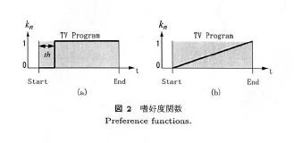
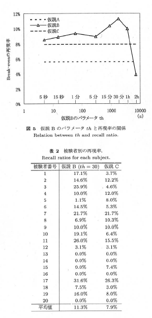
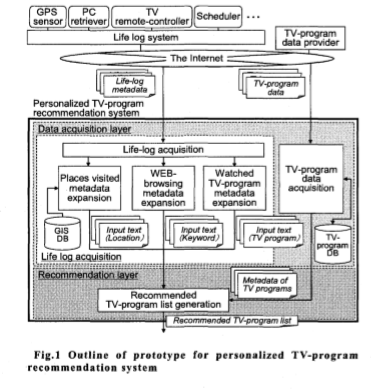
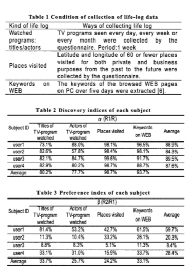

```{r setup, include=FALSE}
knitr::opts_chunk$set(echo = FALSE, 
                      warning = FALSE,
                      message = FALSE)
```

```{r set_up}
#パッケージのインストールと読み込み
#持ってないパッケージはインストールする
targetPackages <- c('knitr','DBI','tidyverse',"reshape2","lubridate","dbplot","DT") 
newPackages <- targetPackages[!(targetPackages %in% installed.packages()[,"Package"])]
if(length(newPackages)) install.packages(newPackages, repos = "http://cran.us.r-project.org")
for(package in targetPackages) library(package, character.only = T)


theme_set(theme_bw(base_family = "HiraKakuPro-W3"))

```
# テレビ視聴者の選局行動に基づく番組嗜好度の推定

黒木, 廣瀬, 鈴木, 片岡, 沼, 山本[2005]   

## 目的

選局した番組に対してどの程度興味を示しているのか, 時間軸上の選局操作と番組に対する嗜好度合いとの関係から推薦を行い, 仮説の妥当性を検証する.

## 学習と推薦方法
コンテンツの特徴の個数$I$個
番組のコンテンツの特徴ベクトル$H_n$  
番組に対する嗜好度合い（評価値）$k_n$  

$$
H = \frac{1}{\sqrt{\sum^{I}_{i=1}{c_i^2}}}\{c_1, c_2, ..., c_I\}
$$
$$
P = \sum^{N}_{n=1}{k_{n}H_{n}}
$$

$$
v_m = P・H_m
$$


## 仮説
-仮説A: すべての選局番組に興味がある($k_n = 1$)
-仮説B: 番組に対する嗜好度合い$k_n$は, 図2(a)のように, ある視聴時間$th$を境に"$0$"(興味なし)か"$1$"(興味あり)のどちらかわかれる.
-仮説C: 番組に対する嗜好度合い$k_n$は, 図2(b)のように, 視聴時間$t$に比例する.  




## 実験
20人の被験者に対して4週間にわたって記録し, ユーザプロファイル$P$を学習する.  
特徴空間の構成を以下に示す.  

|特徴空間    |次元数|  
|------------|---------|  
|大ジャンル  |12次元|  
|チャネル    |8次元|  
|出演タレント|$N_T$次元|   
|番組名      |$N_P$次元|  

ここでは, $N_T=446$, $N_P=2,670$である.

##評価方法
推薦制度の評価値として, break-evenにおける再現率(ユーザーが選択した$M$個の番組とシステムが推薦した上位$M$個の番組との間で重複しているものの割合)を求め, この値が高いほど仮説が妥当であると考える.  

##再現率と妥当性
図5ではbreak-evenにおける再現率を, 仮説ごとに被験者20人の平均値として示している.  
これより, 仮説Bかつ, 最大値11.3%に達した$th=30$[分]に境界を設定することが妥当である.  
表2で示した結果から仮説Bに対して$th=30$[分]でT検定を行うと, 有意水準5.08%で有意差があると認められた.  

##VR cubicを用いれば
-0%の被験者は見たい番組と見れる時間帯が一致しなかったことなどがあげられる.  
→今回のタイムシフトのデータを用いればこのパターンは減らすことができると考えられる.  

-被験者が20人と少ない, 期間が4週間のみ
→被験者数は5000人まで展開可能, レポートをみると3カ月のクールで周期性も見られたのでのばすと有効?

-空間構成は再設定が必要
→大ジャンルが8次元, チャネルは7次元, 出演者はまだ紐づけていないので設定が必要.  
→新番と最終回は新しく特徴として組み込むと有効だと考えられる.  





# ライフログを用いたテレビ番組推薦システムの提案

中村, 伊藤, 手塚, 石原, 武藤, 阿部[2010]  
## 目的
  
ユーザーの興味を可能な限り追求しながら, 推薦の多様性を高めること  
ユーザの行動履歴をライフログと呼び, ユーザのライフログを利用した個人向けのテレビ番組推薦システムを提案する. 

 

## 構築した推薦システムのコンセプト 
  
ライフログを用いる利点は以下2点  
①セレンディピティの高さ（ユーザに気づかれていない番組の推薦） 
②即時性（データがすぐに反映されるので, 嗜好の変化も特定可能） 

## 実装  

プロトタイプ概要を図1に示す. 


  
ライフログデータを収集するライフログシステムと, TV番組推薦システムとからなる.   
ライフログシステムは, 番組名, 番組出演者, 訪問した場所, WEB閲覧キーワードから構成される. 
  
TV推薦システムは、データ取得層と推薦層で構成されている(訓練データとテストデータ？) . データ取得層は、他の情報の中で、訪れた場所の緯度/経度、キーワード、およびテレビ番組を得るためにライフログにアクセスする。 
  
TV番組のメタデータ（番組名、出演者、文脈）に対して「テキスト入力」を行い、類似度を計算し, 類似度の高いテレビ番組が選択され, レコメンドとして提示される. プロトタイプは, 概念検索（自然言語文検索）アルゴリズムを使用して類似性を計算する. 類似度は, ベクトルに変換された「入力テキスト」と, ベクトルに変換されたテレビ番組のメタデータとの組み合わせから計算される。 

## 評価 



表1: ライフログの内容

表2: 発見指数 α = R1 / R  
R1は被験者が未視聴の推薦した番組の数, Rは推薦した番組の総数  

表3: 嗜好指数 β = R2 / R1  
R2はR1, すなわち未視聴の推薦番組の中で被験者が4以上のスコアを与えたプログラムの数  


表2より訪問した場所およびWEBの閲覧キーワードは, 視聴した番組よりも効果的であったことがわかった．
すなわち, 番組名や番組出演者に基づく推薦では, 推薦されなくてもすでに視聴している番組が多くあったということ. 

表3に示す4項目のライフログのβ値は, 被験者によって高い満足度を得るための有効なライフログの種類が異なることを示している.本実験では被験者数は少ないが, 推薦リストを作成する際のユーザの特性を考慮することが重要と考えられる. 

# 視聴状況に応じた番組推薦のための視聴傾向抽出手法の検討

立川, 関[2012]

##目的
 