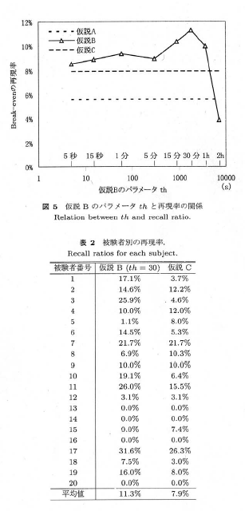

```{r setup, include=FALSE}
knitr::opts_chunk$set(echo = FALSE, 
                      warning = FALSE,
                      message = FALSE)
```

```{r set_up}
#パッケージのインストールと読み込み
#持ってないパッケージはインストールする
targetPackages <- c('knitr','DBI','tidyverse',"reshape2","lubridate","dbplot","DT") 
newPackages <- targetPackages[!(targetPackages %in% installed.packages()[,"Package"])]
if(length(newPackages)) install.packages(newPackages, repos = "http://cran.us.r-project.org")
for(package in targetPackages) library(package, character.only = T)


theme_set(theme_bw(base_family = "HiraKakuPro-W3"))

```

黒木, 廣瀬, 鈴木, 片岡, 沼, 山本[2005]   

# 目的

選局した番組に対してどの程度興味を示しているのか, 時間軸上の選局操作と番組に対する嗜好度合いとの関係から推薦を行い, 仮説の妥当性を検証する.

# 学習と推薦方法
- ユーザプロファイル:$P$  
- コンテンツの特徴数:$I$個  
- コンテンツ（番組）の特徴ベクトル:$H_n$   
- コンテンツ（番組）$n$に対する嗜好度合い（評価値）:$k_n$  
- 検索コンテンツ$m$に対するユーザの嗜好度合い:$v_m$  
- $I$個のキーワードに対する重み係数:$c_1$~$c_I$  

$$
H = \frac{1}{\sqrt{\sum^{I}_{i=1}{c_i^2}}}\{c_1, c_2, ..., c_I\}
$$

$$
P = \sum^{N}_{n=1}{k_{n}H_{n}}
$$

$$
v_m = P・H_m
$$


## 仮説

- 仮説A: すべての選局番組に興味がある($k_n = 1$)  
- 仮説B: 番組に対する嗜好度合い$k_n$は, 図2(a)のように, ある視聴時間$th$を境に"$0$"(興味なし)か"$1$"(興味あり)のどちらかわかれる.  
- 仮説C: 番組に対する嗜好度合い$k_n$は, 図2(b)のように, 視聴時間$t$に比例する. 


# 実験
20人の被験者に対して4週間にわたって記録し, ユーザプロファイル$P$を学習する.  
特徴空間の構成を以下に示す.  

|特徴空間    |次元数|  
|------------|---------|  
|大ジャンル  |12次元|  
|チャネル    |8次元|  
|出演タレント|$N_T$次元|   
|番組名      |$N_P$次元|  

ここでは, $N_T=446$, $N_P=2,670$である.  

##評価方法
推薦制度の評価値として, break-evenにおける再現率(ユーザーが選択した$M$個の番組とシステムが推薦した上位$M$個の番組との間で重複しているものの割合)を求め, この値が高いほど仮説が妥当であると考える.  

##再現率と妥当性
図5ではbreak-evenにおける再現率を, 仮説ごとに被験者20人の平均値として示している.  
これより, 仮説Bかつ, 最大値11.3%に達した$th=30$[分]に境界を設定することが妥当である.  
表2で示した結果から仮説Bに対して$th=30$[分]でT検定を行うと, 有意水準5.08%で有意差があると認められた.  




# 今回のVR qubicとの比較
- 0%の被験者は見たい番組と見れる時間帯が一致しなかったことなどがあげられる.  
→今回のタイムシフトのデータを用いればこのパターンは減らすことができると考えられる.  

- 被験者が20人と少ない, 期間が4週間のみ  
→被験者数は5000人まで展開可能, レポートをみると3カ月のクールで周期性も見られたのでのばすと有効?  
- 空間構成は再設定が必要  
→ 大ジャンルが8次元, チャネルは5次元で設定  
→ 出演者はレギュラー・ゲスト・声・キャラクター・その他の5タイプの紐づけを行った. しかしとても多いため, 頻出ゲストや通年のレギュラー番組だけなど, 選定は必要.  
→ 新番と最終回は新しく特徴として組み込むと有効だと考えられる.  

- 年間で4クールあるので, そのうち1クールで分析し, 他の3クールと比較することも検討.


